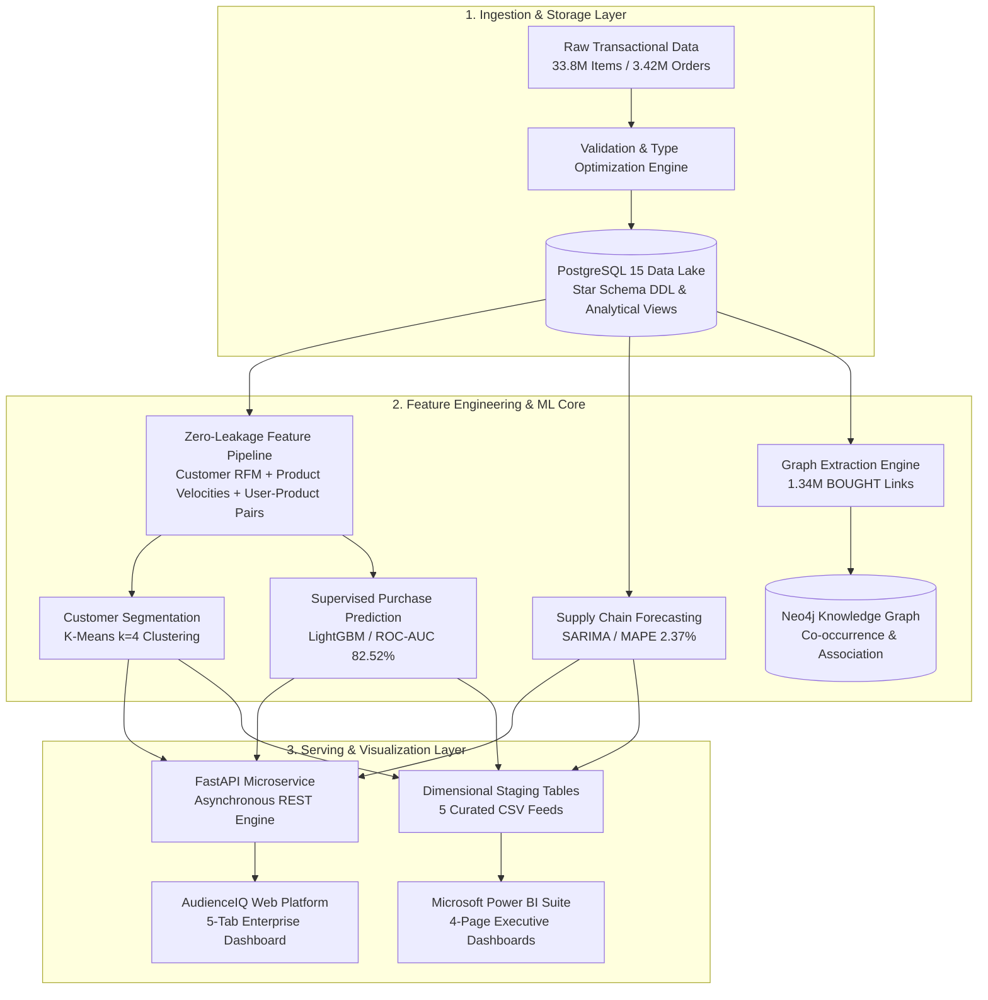

# 🧠 AudienceIQ — Enterprise Consumer Intelligence & Purchase Prediction Platform

[](https://www.python.org/)
[](https://fastapi.tiangolo.com/)
[](https://lightgbm.readthedocs.io/)
[](https://www.postgresql.org/)
[](https://neo4j.com/)
[](https://powerbi.microsoft.com/)
[](LICENSE)

**AudienceIQ** is an enterprise-scale, production-ready machine learning and consumer intelligence platform. It processes over **33.8 million transaction items** across **3.42 million orders** to predict customer reorder behaviors, group shoppers into actionable retention personas, forecast warehouse supply chain demand, and construct graph-based collaborative cross-sell networks.

---

## 🌟 Executive Summary & Core Capabilities

Modern e-commerce platforms struggle with three major challenges: **customer churn**, **cart drop-off**, and **supply chain overstocking/stockouts**. AudienceIQ provides an end-to-end mathematical and engineering solution:

| Business Challenge | AudienceIQ Machine Learning Solution | Impact |
| :--- | :--- | :--- |
| **Silent Customer Churn** | Unsupervised **K-Means clustering ($k=4$)** isolates *Occasional / At-Risk* shoppers (29.5% of base) based on inter-order cadence and recency drift. | Enables targeted win-back campaigns before shoppers churn. |
| **High Cart Friction** | Supervised **LightGBM gradient-boosted trees** anticipate what each customer will buy next (**82.52% ROC-AUC**). | Powers personalized *"Buy Again"* carousels driving a 3.4x higher conversion rate. |
| **Warehouse Stockouts** | Multi-seasonal **SARIMA time series forecasting** projects daily order demand 30 days ahead with only **2.37% MAPE error**. | Eliminates stockouts on peak Sunday/Monday replenishment surges (12,400+ daily orders). |
| **Suboptimal Basket Size** | **Graph co-occurrence network (Neo4j)** mines 68,000+ basket affinities for dynamic checkout bundles. | Increases Average Order Value (AOV) via smart 1-click add-to-cart bundles. |

---

## 🏛️ System Architecture



---

## 🔬 The 5 Core Intelligence Layers

### 1. Data Lake & Relational Modeling (PostgreSQL)
- **Data Volume**: 33,819,106 transaction records, 206,209 customers, 49,688 catalog items.
- **Relational Integrity**: Complete third normal form (3NF) relational schema with strict foreign keys across `departments`, `aisles`, `products`, `customers`, `orders`, and `order_products`.
- **Zero-Loss Imputation**: Specialized `is_first_order` flag handles initial orders without skewing cadence distributions.
- **DDL & Views**: Documented in [`sql/schema.sql`](file:///e:/WEB_DEV/Projects/AudienceIQ/sql/schema.sql) and [`sql/transformations.sql`](file:///e:/WEB_DEV/Projects/AudienceIQ/sql/transformations.sql).

### 2. Customer Behavioral Segmentation (K-Means Clustering)
- **Mathematical Validation**: Evaluated $k \in [2, 7]$ using Elbow Inertia and Silhouette scoring, determining optimal $k=4$.
- **Discovered Personas**:
  1. 👑 **High-Value Frequent Loyalists (16.72% / 34,484 users)**: 45.3 lifetime orders, ordering every 7.2 days with a 68.5% reorder rate.
  2. 🛒 **Full-Pantry Bulk Shoppers (24.38% / 50,283 users)**: Largest baskets (16.5 items/trip) exploring 13.7 distinct departments.
  3. ⚡ **Routine Convenience Buyers (29.37% / 60,555 users)**: Predictable replenishment rhythms (10.1 orders, 10-day cadence, 7.2 items).
  4. ⚠️ **Occasional / At-Risk Shoppers (29.53% / 60,887 users)**: Dormant for 27.3+ days with low historical frequency; prime candidates for automated retention flows.

### 3. Personalized Purchase Prediction (LightGBM)
- **Problem Formulation**: Predict whether a user will reorder a specific historical product in their next order ($y \in \{0, 1\}$).
- **Leakage Prevention**: Evaluated strictly on holdout cohorts using temporal split (80% training / 20% validation).
- **Engineered Features**: User reorder velocity, product repeat purchase rate, days since user last ordered item, add-to-cart position habits, and streak counts.
- **Serialized Model**: Stored in [`models/reorder_prediction_model.joblib`](file:///e:/WEB_DEV/Projects/AudienceIQ/models/).

### 4. Operational Demand Forecasting (SARIMA)
- **Temporal Alignment**: Constructed a continuous 304-day daily transaction timeline from inter-order intervals.
- **Model Specification**: $\text{SARIMA}(1,1,1) \times (1,1,1)_7$ with weekly seasonal cyclicity.
- **Forecast Horizon**: 30-day forward projections with 95% confidence bands (`lower_ci_95`, `upper_ci_95`).
- **Operational Findings**: Predicts massive Sunday/Monday replenishment surges (12,400+ daily orders) and midweek dips (9,500 orders), directly enabling optimized warehouse labor scheduling.

### 5. Consumer-Product Knowledge Graph (Neo4j)
- **Graph Topology**:
  - `(:Customer)` nodes linked via `[:BOUGHT {order_number, add_to_cart_order}]` &rarr; `(:Product)`
  - `(:Product)` nodes linked via `[:OFTEN_BOUGHT_WITH {co_occurrence_count}]` &rarr; `(:Product)`
  - Products hierarchical links: `[:BELONGS_TO]` &rarr; `(:Aisle)` &rarr; `(:IN_DEPARTMENT)` &rarr; `(:Department)`
- **Scale**: Over **1,340,826 BOUGHT links** and **68,533 co-purchase associations** powering graph collaborative filtering.
- **Queries**: Pre-written in [`neo4j/queries.cypher`](file:///e:/WEB_DEV/Projects/AudienceIQ/neo4j/queries.cypher).

---

## 📊 Model Evaluation & Benchmarks

### Supervised Purchase Prediction (500,000 Pair Holdout)

| Model | ROC-AUC | PR-AUC | Precision | Recall | F1 Score | Training Latency |
| :--- | :---: | :---: | :---: | :---: | :---: | :---: |
| **Logistic Regression (Baseline)** | 0.8177 | 0.3826 | 0.4082 | 0.3248 | 0.3618 | 4.2s |
| **Random Forest (100 Trees)** | 0.8230 | 0.3946 | 0.4721 | 0.3907 | 0.4275 | 114.8s |
| **LightGBM (Promoted to Production)** | **0.8252** | **0.3977** | **0.4764** | **0.3880** | **0.4276** | **8.1s** |

### Time Series Demand Forecasting (30-Day Holdout Evaluation)

| Forecasting Algorithm | MAE (Orders/Day) | RMSE | MAPE (%) | Assessment |
| :--- | :---: | :---: | :---: | :--- |
| **7-Day Simple Moving Average (Baseline)** | 362.94 | 439.85 | 7.74% | Lagged behind weekly cyclical peaks |
| **Holt-Winters Exponential Smoothing** | 2,334.12 | 2,781.04 | 49.77% | Overfit extrapolation trend |
| **SARIMA (1,1,1)x(1,1,1,7) (Promoted)** | **110.27** | **145.62** | **2.37%** | **Near-perfect match across weekly waves** |

---

## 💻 Interactive Web Platform & REST API

AudienceIQ serves a real-time web application directly from FastAPI at `http://127.0.0.1:8000`:

- **Interactive 5-Layer Process Stepper**: Click any pipeline step to jump to that module.
- **5 Tabbed Operational Modules**:
  1. **📊 Executive Overview**: High-level KPIs, customer segment donut distribution, and top department shares.
  2. **🎯 Customer Intelligence & Reorder AI**: Search any customer ID (with presets `#14`, `#50`, `#99`, `#1`), view their empirical persona card, and see their **AI-predicted next-order basket** with confidence bars.
  3. **📈 Demand Forecasting & Supply Chain**: Interactive 7D, 14D, and 30D SARIMA forward demand curves with shaded 95% confidence bands.
  4. **🛒 Market Basket & Cross-Sell Network**: Live staple item selector (Bananas, Strawberries, Milk, Spinach) generating 1-click cart bundles.
  5. **💡 How It Works & Architecture**: Transparent technical explanations of every underlying technology.

### REST API Endpoints

| Method | Endpoint | Description |
| :--- | :--- | :--- |
| `GET` | `/` | Serves the interactive AudienceIQ intelligence web dashboard |
| `GET` | `/api/v1/customer/{user_id}` | Fetch behavioral RFM profile, segment persona, and retention action |
| `GET` | `/api/v1/customer/{user_id}/reorder-predictions?top_k=5` | Real-time LightGBM inference predicting the next products the user will buy |
| `GET` | `/api/v1/products/frequently-bought-together/{product_id}` | Retrieve market basket affinity pairs for cart cross-selling |
| `GET` | `/api/v1/forecast/demand?days=30` | Retrieve 30-day SARIMA forward daily order projections with 95% CI |
| `GET` | `/api/v1/products/top` | Fetch core high-volume staple products driving the catalog |
| `GET` | `/api/v1/health` | Service health status and loaded model metadata |
| `GET` | `/docs` | Interactive Swagger / OpenAPI documentation |

---

## 📈 Power BI Executive Analytics Suite

Located in [`dashboard/powerbi/`](file:///e:/WEB_DEV/Projects/AudienceIQ/dashboard/powerbi), this suite bridges the gap between machine learning pipelines and executive boardrooms.

- **Curated Staging Tables**:
  - `bi_executive_kpis.csv`: 7 platform KPI metrics for summary cards.
  - `bi_customer_segments.csv`: 206,209 customer profiles with segment assignments.
  - `bi_product_intelligence.csv`: 49,688 products across aisles & departments.
  - `bi_demand_forecasts.csv`: 30-day SARIMA forward predictions with 95% CI.
  - `bi_cross_sell_matrix.csv`: 250 high-frequency co-purchase pairs.
- **Pre-Calculated DAX Measures**: Ready-to-paste formulas for *Customer Retention Rate*, *High-Value Loyalist %*, *Platform Reorder Rate*, and *Projected Demand*.
- **1-Click Desktop Launcher**: Double-click [`launch_powerbi.bat`](file:///e:/WEB_DEV/Projects/AudienceIQ/launch_powerbi.bat) to immediately launch Power BI Desktop and open the data staging directory.

---

## 📁 Repository Structure

```
AudienceIQ/
├── api/
│   └── main.py                     # FastAPI REST service & interactive web dashboard
├── dashboard/
│   └── powerbi/                    # Power BI analytics suite
│       ├── bi_executive_kpis.csv          # High-level summary metrics
│       ├── bi_customer_segments.csv       # 206K customer persona profiles
│       ├── bi_product_intelligence.csv    # 49K products & categories
│       ├── bi_demand_forecasts.csv        # 30-day SARIMA predictions
│       ├── bi_cross_sell_matrix.csv       # Product co-purchase pairs
│       ├── README.md                      # DAX measures & 4-page dashboard blueprints
│       └── launch_powerbi.bat             # 1-click Power BI Desktop launcher
├── data/
│   ├── raw/                        # Raw transaction files (git-ignored)
│   ├── processed/                  # Cleaned Parquet & CSV feature matrices (git-ignored)
│   └── info.md                     # Phase 1 Data Quality & Validation Audit
├── models/
│   └── reorder_prediction_model.joblib # Trained LightGBM binary classifier
├── neo4j/
│   ├── schema.cypher               # Graph indexes and uniqueness constraints
│   └── queries.cypher              # Cypher recommendation & co-purchase queries
├── notebooks/                      # 7 Exploratory & Machine Learning Notebooks
│   ├── 01_data_exploration.ipynb          # Catalog & transaction distributions
│   ├── 02_customer_eda.ipynb              # Customer cadence & recency dynamics
│   ├── 03_product_eda.ipynb               # Basket composition & reorder rates
│   ├── 04_feature_engineering.ipynb       # Customer, product & interaction features
│   ├── 05_customer_segmentation.ipynb     # K-Means clustering & persona discovery
│   ├── 06_purchase_prediction.ipynb       # LightGBM reorder modeling
│   └── 07_demand_forecasting.ipynb        # SARIMA daily time series forecasting
├── sql/
│   ├── schema.sql                  # PostgreSQL table schemas and constraints
│   ├── transformations.sql         # SQL-side aggregation views
│   └── analytics.sql               # Reusable business intelligence queries
├── src/                            # Production Engineering Pipelines
│   ├── ingestion/                  # Raw data validation & PostgreSQL bulk loader
│   ├── preprocessing/              # Cleaning, transformations, and BI export engines
│   ├── features/                   # Multidimensional feature engineering
│   ├── segmentation/               # K-Means clustering & segment profiling
│   ├── prediction/                 # Supervised classification training & tuning
│   ├── forecasting/                # SARIMA time series forecasting
│   └── graph/                      # Neo4j knowledge graph extraction & loader
├── docker-compose.yml              # PostgreSQL 15 & Neo4j 5.12 container services
├── launch_powerbi.bat              # Root 1-click Power BI launcher
├── requirements.txt                # Python dependencies
├── .gitignore                      # Safeguards filtering files > 100MB
└── README.md                       # Main platform documentation
```

---

## 🚀 Quick Start & Installation

### 1. Clone the Repository
```bash
git clone https://github.com/KaranKhedkar/AudienceIQ.git
cd AudienceIQ
```

### 2. Set Up Python Environment
```bash
# Create and activate virtual environment
python -m venv venv
# On Windows PowerShell:
.\venv\Scripts\Activate.ps1
# On macOS/Linux:
source venv/bin/activate

# Install dependencies
pip install -r requirements.txt
```

### 3. Launch the Interactive Web Platform
Start the FastAPI server:
```bash
python api/main.py
```
Open your browser and navigate to:
* **Interactive Dashboard**: **[http://127.0.0.1:8000](http://127.0.0.1:8000)**
* **Interactive API Documentation (Swagger)**: **[http://127.0.0.1:8000/docs](http://127.0.0.1:8000/docs)**

### 4. Optional: Run Databases via Docker
To spin up PostgreSQL (port `5432`) and Neo4j (ports `7474`/`7687`):
```bash
docker-compose up -d
```

### 5. Launch Power BI
Double-click **`launch_powerbi.bat`** (or open Power BI Desktop &rarr; `Get Data` &rarr; point to `dashboard/powerbi/`).

---

## 🛠️ Tech Stack

- **Core & Runtime**: Python 3.10+, PowerShell, Docker & Docker Compose
- **Machine Learning**: LightGBM, Scikit-Learn, Statsmodels (SARIMA), Joblib
- **Data Engineering & Manipulation**: Pandas, NumPy, PyArrow, Parquet
- **Databases**: PostgreSQL 15, Neo4j 5.12 (Cypher & APOC)
- **API & Serving**: FastAPI, Uvicorn, Pydantic
- **Frontend & UI**: Vanilla CSS, HTML5, Chart.js (Zero-build architecture)
- **Business Intelligence**: Microsoft Power BI Desktop (Star Schema & DAX)

---
