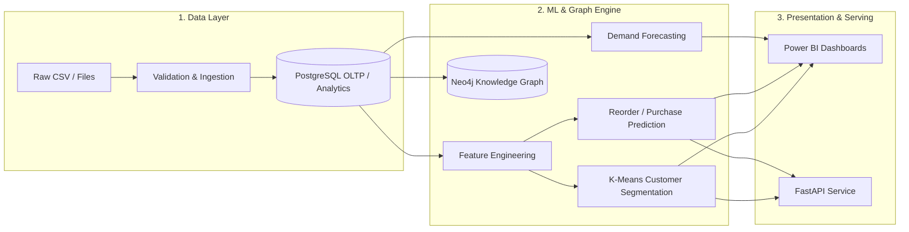

# AudienceIQ — Consumer Intelligence & Purchase Prediction Platform

AudienceIQ is an enterprise-grade, end-to-end data science and machine learning platform that ingests large-scale e-commerce transaction data and converts it into predictive consumer intelligence, demand forecasts, customer segmentation, knowledge graphs, and executive BI dashboards.

---

## 🏛️ System Architecture



---

## 📁 Repository Structure

```
AudienceIQ/
├── data/
│   ├── raw/                 # Raw input datasets (Instacart / custom transactions)
│   ├── processed/           # Cleaned & transformed tables
│   └── info.md              # Data dictionary & quality validation report
├── notebooks/
│   ├── 01_data_exploration.ipynb      # Initial data exploration
│   ├── 02_customer_eda.ipynb          # Customer behavior & frequency
│   ├── 03_product_eda.ipynb           # Basket analysis & co-occurrence
│   ├── 04_feature_engineering.ipynb   # Customer/Product feature pipelines
│   ├── 05_customer_segmentation.ipynb # K-Means clustering & segment profiling
│   ├── 06_purchase_prediction.ipynb   # Reorder classification models
│   └── 07_demand_forecasting.ipynb    # Time series demand forecasts
├── src/
│   ├── ingestion/           # Raw data ingestion & validation scripts
│   ├── preprocessing/       # Cleaning, normalization, and relational structuring
│   ├── features/            # Feature computation engines (RFM, affinities, etc.)
│   ├── segmentation/        # Unsupervised clustering routines
│   ├── prediction/          # Supervised binary classification models
│   ├── forecasting/         # Time series models (ARIMA, Prophet, Exponential Smoothing)
│   └── graph/               # Neo4j graph loaders and Cypher generators
├── sql/
│   ├── schema.sql           # PostgreSQL table schemas and constraints
│   ├── transformations.sql  # SQL-side transformation logic
│   └── analytics.sql        # Reusable analytical views
├── neo4j/
│   ├── schema.cypher        # Graph indexes and constraints
│   └── queries.cypher       # Knowledge graph queries (affinity, recommendations)
├── dashboard/
│   └── powerbi/             # Power BI templates, data models, and documentation
├── api/                     # FastAPI backend microservice
├── requirements.txt         # Project dependencies
├── README.md                # Main documentation
└── .gitignore               # Ignored files and artifacts
```

---

## 🚀 Execution Phases

1. **Phase 1**: Data Ingestion & Quality Validation (schema profiling, integrity checks)
2. **Phase 2**: Data Cleaning & Relational Transformation
3. **Phase 3**: PostgreSQL Schema & Analytical Views
4. **Phase 4**: Exploratory Data Analysis (EDA)
5. **Phase 5**: Feature Engineering Engine (RFM, Diversity, Temporal Features)
6. **Phase 6**: Customer Segmentation (K-Means with Elbow & Silhouette)
7. **Phase 7**: Purchase / Reorder Prediction (Supervised Classification)
8. **Phase 8**: Demand Forecasting (Time Series Analysis)
9. **Phase 9**: Consumer-Product Knowledge Graph (Neo4j)
10. **Phase 10**: Power BI Analytical Reporting & Dashboards
11. **Phase 11**: FastAPI Serving Layer
