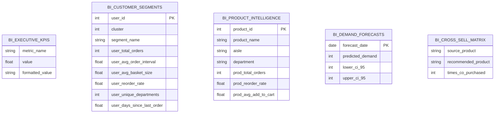

# 📊 AudienceIQ — Power BI Business Intelligence Suite

This directory contains the curated staging datasets, dimensional data model specifications, DAX measure definitions, and dashboard wireframe templates for the **AudienceIQ Consumer Intelligence & Purchase Prediction Platform**.

---

## 🚀 Quick Start: How to Open & Run in Power BI (In 60 Seconds)

> [!NOTE]
> **Power BI Desktop is already installed on your PC** at `C:\Program Files\Microsoft Power BI Desktop\bin\PBIDesktop.exe`.
> The files in this folder are **staging data tables (`.csv`)**, not executable code. You load them into Power BI Desktop to visualize.

### Method 1: Double-Click the 1-Click Launcher
Simply double-click [`launch_powerbi.bat`](file:///e:/WEB_DEV/Projects/AudienceIQ/launch_powerbi.bat) at the root of the project (or in this folder).
It will automatically launch **Power BI Desktop** and open the folder containing all 5 tables in File Explorer.

### Method 2: Manual 3-Step Import in Power BI Desktop
1. Open **Power BI Desktop** from your Windows Start Menu (or run `launch_powerbi.bat`).
2. On the home ribbon, click **Get Data** &rarr; **Text/CSV**.
3. Select any (or all) of the 5 CSV tables below and click **Load**:
   - `bi_executive_kpis.csv`: 7 platform KPI metrics for summary scorecards.
   - `bi_customer_segments.csv`: 206,209 customer profiles with persona clusters.
   - `bi_product_intelligence.csv`: 49,688 products across aisles & departments.
   - `bi_demand_forecasts.csv`: 30-day SARIMA forward demand predictions with 95% CI.
   - `bi_cross_sell_matrix.csv`: 250 high-affinity product co-purchase pairs.
4. Drag fields onto the canvas or paste the DAX measures below to create charts!

---


## 🏛️ Power BI Star Schema & Data Model



---

## 📂 Exported Staging Tables in `dashboard/powerbi/`

| File Name | Records | Purpose in Power BI |
| :--- | :--- | :--- |
| **`bi_executive_kpis.csv`** | 7 metrics | KPI Cards & High-Level Summary Ribbon |
| **`bi_customer_segments.csv`** | 206,209 rows | Customer Dimension, RFM Scatter Plots, Segment Slicers |
| **`bi_product_intelligence.csv`** | 49,688 rows | Product Dimension, Category Hierarchy, Top Bestsellers |
| **`bi_demand_forecasts.csv`** | 30 rows | Forward Demand Line Charts with 95% Confidence Ribbon |
| **`bi_cross_sell_matrix.csv`** | 250 rows | Cross-Sell Affinity Table & Association Visuals |

---

## 📐 Essential DAX Measures

### 1. Total Customer Count
```dax
Total Customers = DISTINCTCOUNT(bi_customer_segments[user_id])
```

### 2. Weighted Average Basket Size
```dax
Avg Basket Size = AVERAGE(bi_customer_segments[user_avg_basket_size])
```

### 3. Overall Platform Reorder Percentage
```dax
Platform Reorder Rate % = AVERAGE(bi_customer_segments[user_reorder_rate]) * 100
```

### 4. High-Value Customer Share
```dax
High Value Loyalists % = 
DIVIDE(
    CALCULATE(COUNTROWS(bi_customer_segments), bi_customer_segments[segment_name] = "High-Value Frequent Loyalists"),
    COUNTROWS(bi_customer_segments)
) * 100
```

### 5. Forecast Demand Summary (30 Days)
```dax
Total 30D Projected Orders = SUM(bi_demand_forecasts[predicted_demand])
```

---

## 📑 Dashboard Pages & Layout Design

### Page 1: 🏢 Executive Overview
- **Header Cards**: Total Customers (206K), Platform Orders (3.42M), Average Basket Size (10.1 items), Global Reorder Rate (58.9%).
- **Visual 1 (Donut Chart)**: Customer Segment Distribution (Routine Convenience vs. High-Value Loyalists vs. Bulk Shoppers vs. At-Risk).
- **Visual 2 (Bar Chart)**: Top 10 High-Velocity Departments by Order Volume.
- **Visual 3 (Line Chart)**: 30-Day Forward Projected Demand Trend.

### Page 2: 👥 Customer Intelligence & Segmentation
- **Segment Slicer**: Multi-select dropdown filtering by Segment Persona.
- **Visual 1 (Scatter Plot)**: Order Cadence (Days Between Orders) vs. Total Lifetime Orders, color-coded by Persona.
- **Visual 2 (Clustered Column Chart)**: Average Basket Size & Department Diversity per Segment.
- **Visual 3 (Data Grid Table)**: Top 100 high-value customers eligible for VIP retention perks.

### Page 3: 🥦 Product Intelligence & Market Basket Analysis
- **Department / Aisle Slicers**: Interactive cross-filtering.
- **Visual 1 (Horizontal Bar Chart)**: Top 20 Most Reordered Products (Volume vs. Reorder Stickiness).
- **Visual 2 (Matrix Table)**: Frequently Bought Together Products (`source_product` $\to$ `recommended_product` with `times_co_purchased`).
- **Visual 3 (Line Chart)**: Reorder Rate by Add-to-Cart Sequence Position (Staple items curve).

### Page 4: 📈 Predictive Analytics & Demand Planning
- **Visual 1 (Time Series Line Chart)**: Historical actual demand vs. 30-day forward forecast with upper/lower 95% confidence bands.
- **Visual 2 (Summary Cards)**: Projected Peak Day Demand, Projected 30-day cumulative volume.
- **Visual 3 (Model Scorecard)**: Supervised Classification ROC-AUC (82.5%), PR-AUC (39.8%), SARIMA MAPE (2.37%).

---

## 🔌 1-Click Import Instructions in Power BI Desktop
1. Open **Power BI Desktop**.
2. Click **Get Data** $\to$ **Text/CSV**.
3. Select each file from `dashboard/powerbi/` (`bi_customer_segments.csv`, `bi_product_intelligence.csv`, etc.).
4. Click **Load**.
5. Switch to the **Model View** to confirm relationships, create DAX measures from the section above, and build the 4-page dashboard!
